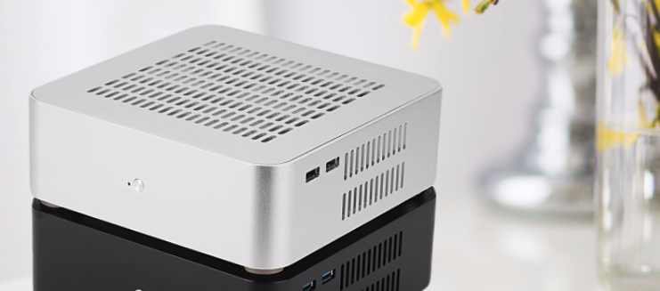

[](https://996.icu)
[](https://github.com/996icu/996.ICU/blob/master/LICENSE)

个人使用的几个Hackintosh Machine，分享给有需要的朋友。

```
Desktop1: i3-8100, MSI B360M Fire, Yeston RX570, 8G*2 DDR4 corsair, Intel 760p M.2 NVMe, macOS10.15.1
Desktop2: i3-8100, Onda H310 ITX, 8G*2 DDR3 Onda, Intel 540s M.2 Sata, macOS10.14.6
Desktop3: Dell 9020m, i5-4670T, 4G*2 DDR3L Samsung, Samsung 850 EVO, macOS10.15.1
Laptop: Thinkpad T450, i5-5300u, 8G*2 DDR3L, macOS10.14.6, mSata 256G
```

**使用须知**：请使用Clover Configurator替换一个新的SMBIOS。否则多账户多机器使用同一个硬件ID，**会被苹果封锁AppleID的**。

## My Hackintosh Handcraft
#### iMac (Retina 4K, 21.5-inch, 2019) & 2018 Mac Mini
- CPU：2018年发布的Intel 8代core i3，性能得到了相当的提升。4核@3.6GHz的i3-8100，日常办公影音空闲率在50%以上，性能上够用，TDP 65W散热基本问题不大。
- 显卡：10.14以后，免驱的就是AMD的RX系列和Nvidia的老系列卡了，选了盈通570。装个双系统的话，可以在Windows下面打打Steam小游戏。i3自带的UHD630的性能也还可以，普通带一两个1080P显示器问题也不大。
- 主板+存储：微星品牌还是可以的，B360m Fire是22*18的MATX主板，作为主力机没问题，选用了Intel 760P这款兼容性好的SSD。Mini主机压缩预算考虑，选了昂达全固态H310ITX板子，选用DDR3专用条，可以省下一笔钱，使用了Intel 540S M.2 Sata SSD。
- 机箱+电源：Mini主机选用了外置电源DC-ATX适配器+联达直插式电源的方式，因为ITX机箱内置电源通常噪声很大；机箱选用了厚实的联达铝制机箱`19*19*6,5`，只需要30块的大镰刀下压风扇，基本上散热静音都OK了。这款小主机配置和Mac Mini2018基础款差不多，618不到¥1800就拿下了，很划算，已稳定办公半年左右。
- 网卡：选用了“免驱”USB Wifi，CF-915AC/CF-811AC，10.13下免驱，Mojave下安装某个版本的官方驱动很稳定，Catalina下官方驱动不支持64位要安装开源的驱动。主板自身的以太网卡这几年变化很小，也可以很好的驱动，主板声卡也一样。
- 挑战：主力机同iMac 2019配置，完全从零开始整，遇到了一个关机自动重启的bug，翻了好久的帖子，试了很多方法才搞好的，release log里面有fix方法。用了1年了很稳定。



#### iMac (21.5-inch, Late 2013)
- 4代U现在已经进入了性价比非常高的阶段，4核4线程的i5，价格三四百。Dell 9020M/HP 800G1 DM这样的4代顶级Q87芯片组小机箱，仅·`18*18*3.5`和一本书差不多大，准系统也才三四百，都买不到上面一块昂达的ITX，Dell/HP做工应该还是蛮不错。CPU选择i5-4670T，Benchamrk数据比i5-6500T要好，i5-6500T需要搭乘的7040M准系统也更加贵😝。
- 咸鱼到手后，全部拆了一遍，清灰上了Arctic的硅脂，这几天稳定下来后，温度维持在40～50度之间。CPU风扇声音嗡嗡嗡还是很明显，有点恼人，看看换一个新的风扇行不行，或者能不能淘一个铜底带散热管的薄散热器，毕竟机箱容许高度就2cm。


#### MacBook Pro (Retina, 13-inch, Early 2015)
```
                    'c.          szymon@macbook2015.local
                 ,xNMM.          ------------------------
               .OMMMMo           OS: macOS Mojave 10.14.6 18G87 x86_64
               OMMM0,            Host: Hackintosh (SMBIOS: MacBookPro12,1)
     .;loddo:' loolloddol;.      Kernel: 18.7.0
   cKMMMMMMMMMMNWMMMMMMMMMM0:    Uptime: 9 mins
 .KMMMMMMMMMMMMMMMMMMMMMMMWd.    Packages: 42 (brew)
 XMMMMMMMMMMMMMMMMMMMMMMMX.      Shell: bash 3.2.57
;MMMMMMMMMMMMMMMMMMMMMMMM:       Resolution: 1600x900
:MMMMMMMMMMMMMMMMMMMMMMMM:       DE: Aqua
.MMMMMMMMMMMMMMMMMMMMMMMMX.      WM: Quartz Compositor
 kMMMMMMMMMMMMMMMMMMMMMMMMWd.    WM Theme: Blue (Light)
 .XMMMMMMMMMMMMMMMMMMMMMMMMMMk   Terminal: iTerm2
  .XMMMMMMMMMMMMMMMMMMMMMMMMK.   Terminal Font: Monaco 12
    kMMMMMMMMMMMMMMMMMMMMMMd     CPU: Intel i5-5300U (4) @ 2.30GHz
     ;KMMMMMMMWXXWMMMMMMMk.      GPU: Intel HD Graphics 5500
       .cooc,.    .,coo:.        Memory: 4841MiB / 16384MiB
```
- 公司的老电脑，5代的低压U，跑上Mojave我觉得速度还是比Windows10要快一点。平时不大用。

## mac_utils 辅助工具文件夹
- neofetch: 查看系统spec
- 查看cpu核心数: `sysctl hw.physicalcpu`, `sysctl hw.logicalcpu`
- 查看空余内存: `alias free="top -l 1 -s 0 | grep PhysMem"`
- HWSensors.6.26.1800.zip: kexts和app结合的硬件温度和使用情况的状态栏监测工具，仅适用于Hackintosh。我习惯用这个。
- iStatusMenus: 另一个收费状态栏监测工具。mac_utils文件夹有“免费”工具。
- Office 2019: mac_utils文件夹有“免费”工具。
- fliqlo: 时钟屏保。
- CPU-S: 变频测试。
- IntelPowerGadget: Intel官方硬件监测软件。
- EW-7811Un_Mac_driver_v1.0.1.4.zip: **CF-915AC** USB WiFi驱动程序(新版本的驱动都无法稳定支持5G)，适用于Mojave及以前。Catalina需使用 [Wireless USB Adapter-V6.zip](https://github.com/chris1111/Wireless-USB-Adapter/releases)。
- RTLWlanU_MacOS10.9_MacOS10.14_Driver*.zip: **CF-811AC** USB WiFi驱动程序，适用于Mojave及以前。贴[官方下载地址](http://www.comfast.cn/index.php?m=content&c=index&a=show&catid=30&id=335)

## 我是如何从零开始安装Hackintosh的
1. 入门：基于tonymacx86论坛的Install Guide，使用Unibeast制作安装U盘，使用Multibeast完成Post Install的驱动安装和config配置。
2. 一些技术细节：
    - 这几个EFI没有做集成显卡id的注入、ssdt/dsdt等定制，通用性好一点。
    - Clover：是用来引导MacOS系统的，可以同时引导Windows和MacOS双系统。每代MacOS系统更新一般都需要把Clover升级到较新的版本才能无缝OTA升级。升级可参考[某B站视频](https://www.bilibili.com/video/av49751074?t=72)。
    - CLover Configurator：即CCG，通过plist文件配置引导细节，更新Clover和kexts驱动。一般要先加载EFI所在分区，也可以用`diskutil list`查看引导所在EFI分区。
    - Multibeast：系统安装上后，做kexts驱动适配用。默认会把kexts安装到/Library/Extensions/(/L/E)系统目录，为了系统更新后kexts不丢失，我把所有kexts驱动搬迁到/EFI/CLOVER/Kexts/other目录，即驱动和引导放在一起。
    - kexts缓存重建：有时候需要进行重建，可以解决一些开机起不来之类的问题；可以用指令`sudo kextcache -i /`操作，我看日志和网上有很多用Kext Utility操作的很像。


**欢迎微信打赏**

